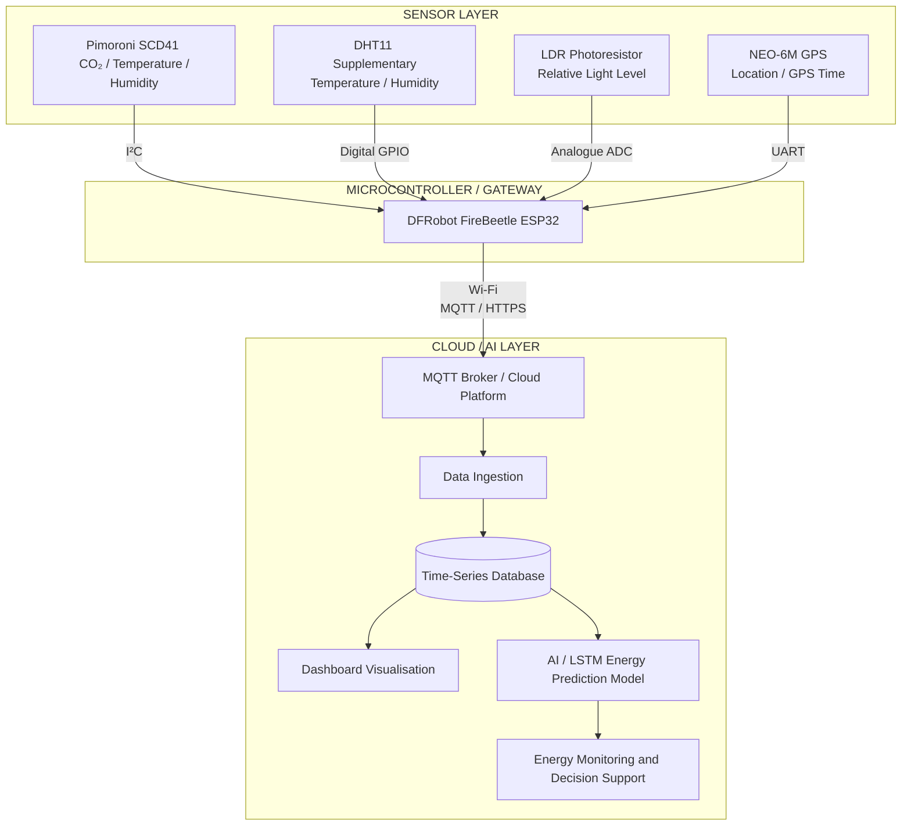

```mermaid
```mermaid
graph TD
    subgraph Cloud_AI_Layer [CLOUD / AI LAYER]
        Hub[MQTT Broker / Cloud Platform] --> Ingest[Data Ingestion]
        Ingest --> DB[(Time-Series Database)]
        DB --> Dashboard[Dashboard Visualisation]
        DB --> AI[AI / LSTM Energy Prediction Model]
        AI --> Decision[Energy Monitoring and Decision Support]
    end

    subgraph Microcontroller_Gateway [MICROCONTROLLER / GATEWAY]
        ESP[DFRobot FireBeetle ESP32]
    end

    subgraph Sensor_Layer [SENSOR LAYER]
        SCD[Pimoroni SCD41 <br> CO₂ / Temperature / Humidity]
        DHT[DHT11 <br> Supplementary Temperature / Humidity]
        LDR[LDR Photoresistor <br> Relative Light Level]
        NEO[NEO-6M GPS <br> Location / GPS Time]
    end

    %% Sensor connections
    SCD -- I²C --> ESP
    DHT -- Digital GPIO --> ESP
    LDR -- Analogue ADC --> ESP
    NEO -- UART --> ESP

    %% Data transmission
    ESP -- Wi-Fi <br> MQTT / HTTPS --> Hub
```
